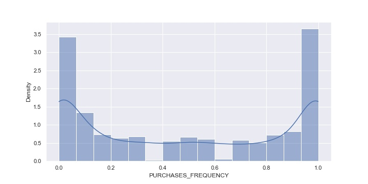

# Projeto Cluster

## Tema: Segmentação de Clientes por Dados de Crédito

Objetivo: Este caso requer o desenvolvimento de uma segmentação de clientes para definir a estratégia de marketing. o
O conjunto de dados de amostra resume o comportamento de uso de cerca de 9.000 titulares de cartões de crédito ativos durante os últimos 6 meses. O arquivo está no nível do cliente com 18 variáveis ​​comportamentais.

 Base de Dados da <a href='https://www.kaggle.com/arjunbhasin2013/ccdata'>Kaggle</a>

### Variáveis do conjunto de dados

* CUSTID: Identificação do titular do cartão de crédito (categórico)
* BALANCE: Saldo restante na conta para fazer compras (
* BALANCEFREQUENCY: a frequência com que o saldo é atualizado, pontuação entre 0 e 1 (1 = atualizado com frequência, 0 = não atualizado com frequência)
* PURCHASES: Quantidade de compras feitas da conta
* ONEOFFPURCHASES: valor máximo da compra feita de uma vez
* INSTALLMENTSPURCHASES: Valor da compra feita a prazo
* CASHADVANCE: adiantamento em dinheiro dado pelo usuário
* PURCHASESFREQUENCY: a frequência com que as compras estão sendo feitas, pontuação entre 0 e 1 (1 = compra frequente, 0 = compra pouco frequente)
* ONEOFFPURCHASESFREQUENCY: a frequência com que as compras acontecem de uma só vez (1 = compra frequente, 0 = compra não frequente)
* PURCHASESINSTALLMENTSFREQUENCY: Com que frequência as compras parceladas estão sendo feitas (1 = feito com frequência, 0 = não feito com frequência)
* CASHADVANCEFREQUENCY: com que frequência o dinheiro adiantado está sendo pago
* CASHADVANCETRX: Número de transações feitas com "Dinheiro adiantado"
* PURCHASESTRX: Numbe de transações de compra feitas
* CREDITLIMIT: Limite de cartão de crédito para o usuário
* PAYMENTS: Valor do pagamento feito pelo usuário
* MINIMUM_PAYMENTS: Quantidade mínima de pagamentos feitos pelo usuário
* PRCFULLPAYMENT: Porcentagem do pagamento total pago pelo usuário
* TENURE: Posse do serviço de cartão de crédito para o usuário

### Quais variáveis podemos trabalhar no contexto da Clusterização

Nessa análise temos apenas variáveis Quantitativas.
Faremos a análise baseado na medida de dissimilaridade, ou seja a distância entre os valores, sendo eles homogêneos dentro do próprio clustes, e heterogêneo entre os clusters.

### Passos da Análise

* **1. Carregando a base de dados**
    
Por meio da biblioteca pandas carregamos o csv disponibilidado pela Kaggle. mencionado acima. Parte do Load do processo de ETL.

* **2. Transformação dos Dados**

    * **2.1 - Coluna de id dos clientes transformada em índice do dataframe** 
        
Primeiro adionamos a coluna de Códigos das Observações em indíves do Dataframe

    * **2.2 - Tratamento dos Dados NAN**
        
Fizemos alguns tratamentos dos valores nans, para adaptar aa análise, e escolhemos o método de adicionar aos valores nans o valor da <b>média</b> daquela coluna, para isso usamos a lib <i>SimpleImputer</i> com o método <i>fit_transform()</i> do <b>sklearn</b>. Para a coluna de Credit_limit retiramos a linha que havia apenas um nan.

    * **2.3 - Tratamento dos Outliers**
        
Consideramos nesse momento o tratamento dos outliers presentes no conjunto de dados, com base em um boxplot gerado inicialmente e com base em dados retirados da análise do gráfico de boxplot, e modo que todos os valores acima ou abaixo da linha de máximo e mínimo respectivamente, fossem imputados dentro desses valores.

    

    * **2.4 - Padronização das Variáveis**
        
Transformamos os dados de tal forma que sua distribuição terá um valor médio 0 e um desvio padrão de 1. Para retirar a discrepância de peso de valores muito maiores que outros. Utilizamos a lib <i>StandardScaler</i> com o método <i>fit_transform()</i> do <b>sklearn</b>

* **3. Análises dos Dados**

    
Nesse ponto a idéia foi usar algumas bases estatísticas para entender como as <i>observações (linha)</i> estão se comportando de acordo com cada <i>variável (coluna)</i>.

    
 No primeiro momento temos a análise das Medidas de Dispersão e Posição. 

    * Pelo método <i>describe()</i> temos:
        * o count que está o mesmo para todas as variáveis, retiramos todos os nans da análise
        * média
        * desvio padrão
        * mínimo
        * máximo
        * quartis:
            * 1º quartil -> 25%
            * 2º quartil -> 50%
            * 3º quartil -> 75%
        * Coeficiente de Variação: Medida de dispersão relativa, relaciona o desvio padrão com a média, quanto menor o CV mais homogêneo são os dados, ou seja mais concentrados em torno da média.

    
 No segundo momento analisamos as Medidas de Forma.

    * 1.1 - Assimetria: Local de concentração da distribuição:
        * 1.1.1 - Curva Simétrica => Média = Mediana = Moda || g = 0
        * 1.1.2 - Curva Assimétrica Direita => Média > Mediana - cauda mais longa à direita || g > 0
        * 1.1.3 - Curva Assimétrica Esquera => Média < Mediana - cauda mais longa à esquerda> || g < 0
    
    * 1.2 - Curtose: Achatamento da curva de distribuição
        * 1.1.1 - Curva com Distribuição Normal -> g = 0
        * 1.1.2 - Curva com Distribuição Alongada -> g > 0
        * 1.1.3 - Curva com Distribuição Achatada -> g < 0

    Resultados: (retirando os outliers temos muitos valores engobados nos mínimos e máximos)

    * **3.1 - BALANCE**
    CV = 110.57% , Assimetria = 1.17, Curtose = 0.20

    No balance temos uma média de 1564 e um desvio padrão de 2081, com base no CV alto percebemos que os dados estão bem espalhados, esse valor diminui um pouco com a remoção dos outilers.

    A assimetria de 1.17, mostra uma tendência a uma cauda mais a direita, maior parte dos dados estão concentrados nos valores mínimos.

    Curtose de 0.20, mostra uma curva com distribuição alongada, mas muito próxima de uma normal.

    

    * **3.2 - BALANCE_FREQUENCY**
    CV = 11.91% , Assimetria = -1.17, Curtose = -0.43

    No balance_frequency temos uma média 0.93 e um desvio padrão de 0.11, com base no CV baixo percebemos que os dados estão bem próximos da média.

    A assimetria de -1.17, mostra uma tendência a uma cauda mais a esqueda, maior parte dos dados estão concentrados nos valores máximos.

    Curtose de -0.43, mostra uma curva com distribuição achatada.

    

    * **3.3 - PURCHASES**
    CV = 119.30% , Assimetria = 1.21, Curtose = 0.15

    No purchases temos uma média 737 e um desvio padrão de 879, com base no CV alto percebemos que os dados estão bem espalhados.

    A assimetria de 1.21, mostra uma tendência a uma cauda mais a direita, maior parte dos dados estão concentrados nos valores mínimos.

    Curtose de 0.15, mostra uma curva com distribuição levemente alongada, tendendo a uma normal.

    

    * **3.4 - ONEOFF_PURCHASES**
    CV = 144.45% , Assimetria = 1.24, Curtose = -0.03

    No oneoff_purchases temos uma média de 354 e um desvio padrão de 512, com base no CV alto percebemos que os dados estão bem espalhados.

    A assimetria de 1.24, mostra uma tendência a uma cauda mais a direita, maior parte dos dados estão concentrados nos valores mínimos.

    Curtose de -0.03, mostra uma curva com distribuição levemente achatada, próxima a uma normal

    

    * **3.5 - INSTALLMENTS_PURCHASES**
    CV = 134.04% , Assimetria = 1.22, Curtose = 0.09

    No installments_purchases temos uma média de 295 e um desvio padrão de 396, com base no CV alto percebemos que os dados estão bem espalhados.

    A assimetria de 1.22, mostra uma tendência a uma cauda mais a direita, maior parte dos dados estão concentrados nos valores mínimos.

    Curtose de 0.09, mostra uma curva com distribuição alongada, mas muito próxima de uma normal.

    

    * **3.6 - CASH_ADVANCE**
    CV = 148.48% , Assimetria = 1.24, Curtose = -0.04

    No cash_advance temos uma média de 672 e um desvio padrão de 998, com base no CV alto percebemos que os dados estão bem espalhados.

    A assimetria de 1.24, mostra uma tendência a uma cauda mais a direita, maior parte dos dados estão concentrados nos valores mínimos.

    Curtose de -0.04, mostra uma curva com distribuição achatada, mas muito próxima de uma normal.

    

    * **3.7 - PURCHASES_FREQUENCY**
    CV = 81.84% , Assimetria = 0.06, Curtose = -1.64

    No purchases_frequency temos uma média de 0.49 e um desvio padrão de 0.40, com base no CV percebemos que os dados estão próximos da média.

    A assimetria de 0.06, mostra uma tendência a uma curva simétrica.

    Curtose de -1.64 mostra uma curva com distribuição achatada

    

    * **3.8 - ONEOFF_PURCHASES_FREQUENCY**
    CV = 138.36% , Assimetria = 1.25, Curtose = 0.12

    No oneoff_purchases_frequency temos uma média de 0.18 e um desvio padrão de 0.26, com base no CV alto percebemos que os dados estão bem espalhados.

    A assimetria de 1.25, mostra uma tendência a uma cauda mais a direita, maior parte dos dados estão concentrados nos valores mínimos.

    Curtose de 0.12, mostra uma curva com distribuição alongada, mas muito próxima de uma normal.

    

    * **3.9 - PURCHASES_INSTALLMENTS_FREQUENCY**
    CV = 109.05% , Assimetria = 0.51, Curtose = -1.40

    No purchases_installments_frequency temos uma média de 0.36 e um desvio padrão de 0.39, com base no CV alto percebemos que os dados estão bem espalhados.

    A assimetria de 0.51, mostra uma tendência a uma cauda mais a direita, maior parte dos dados estão concentrados nos valores mínimos.

    Curtose de -1.40, mostra uma curva com distribuição achatada.

    

    * **3.10 - CASH_ADVANCE_FREQUENCY**
    CV = 136.99% , Assimetria = 1.27, Curtose = 0.42

    No cash_advance_frequency temos uma média de 0.12 e um desvio padrão de 0.17, com base no CV alto percebemos que os dados estão bem espalhados.

    A assimetria de 1.27, mostra uma tendência a uma cauda mais a direita, maior parte dos dados estão concentrados nos valores mínimos.

    Curtose de 0.42, mostra uma curva com distribuição alongada.

    

    * **3.11 - CASH_ADVANCE_TRX**
    CV = 143.42% , Assimetria = 1.28, Curtose = 0.19

    No cash_advance_trx temos uma média de 2.38 e um desvio padrão de 3.41, com base no CV alto percebemos que os dados estão bem espalhados.

    A assimetria de 1.28, mostra uma tendência a uma cauda mais a direita, maior parte dos dados estão concentrados nos valores mínimos.

    Curtose de 0.19, mostra uma curva com distribuição alongada, mas muito próxima de uma normal.

    

    * **3.12 - PURCHASES_TRX**
    CV = 112.19% , Assimetria = 1.14, Curtose = 0.10

    No purchases_trx temos uma média de 11.62 e um desvio padrão de 13.04, com base no CV alto percebemos que os dados estão bem espalhados.

    A assimetria de 1.14, mostra uma tendência a uma cauda mais a direita, maior parte dos dados estão concentrados nos valores mínimos.

    Curtose de 0.10, mostra uma curva com distribuição alongada, mas muito próxima de uma normal.

    

    * **3.13 - CREDIT_LIMIT**
    CV = 76.57% , Assimetria = 1.10, Curtose = 0.45

    No credit_limit temos uma média de 4419 e um desvio padrão de 3383, com base no CV alto percebemos que os dados estão bem espalhados.

    A assimetria de 1.10, mostra uma tendência a uma cauda mais a direita, maior parte dos dados estão concentrados nos valores mínimos.

    Curtose de 0.45, mostra uma curva com distribuição alongada.

    

    * **3.14 - PAYMENTS**
    CV = 94.48% , Assimetria = 1.13, Curtose = 0.07

    No payments temos uma média de 1347 e um desvio padrão de 1272, com base no CV alto percebemos que os dados estão bem espalhados.

    A assimetria de 1.13, mostra uma tendência a uma cauda mais a direita, maior parte dos dados estão concentrados nos valores mínimos.

    Curtose de 0.07, mostra uma curva com distribuição alongada, mas muito próxima de uma normal.

    

    * **3.15 - MINIMUM_PAYMENTS**
    CV = 96.34% , Assimetria = 1.20, Curtose = 0.22

    No minimum_payments temos uma média de 593 e um desvio padrão de 572, com base no CV percebemos que os dados estão próximos da média.

    A assimetria de 1.20, mostra uma tendência a uma cauda mais a direita, maior parte dos dados estão concentrados nos valores mínimos.

    Curtose de 0.22, mostra uma curva com distribuição alongada, mas muito próxima de uma normal.

    

    * **3.16 - PRC_FULL_PAYMENT**
    CV = 158.91% , Assimetria = 1.21, Curtose = -0.29

    No prc_full_payment temos uma média de 0.09 e um desvio padrão de 0.13, com base no CV alto percebemos que os dados estão bem espalhados.

    A assimetria de 1.21, mostra uma tendência a uma cauda mais a direita, maior parte dos dados estão concentrados nos valores mínimos.

    Curtose de -0.29, mostra uma curva com distribuição achatada.

    

    
Analisar melhor TENURE

    
 Para finalizar a Relação entre as variáveis na Correlação

    